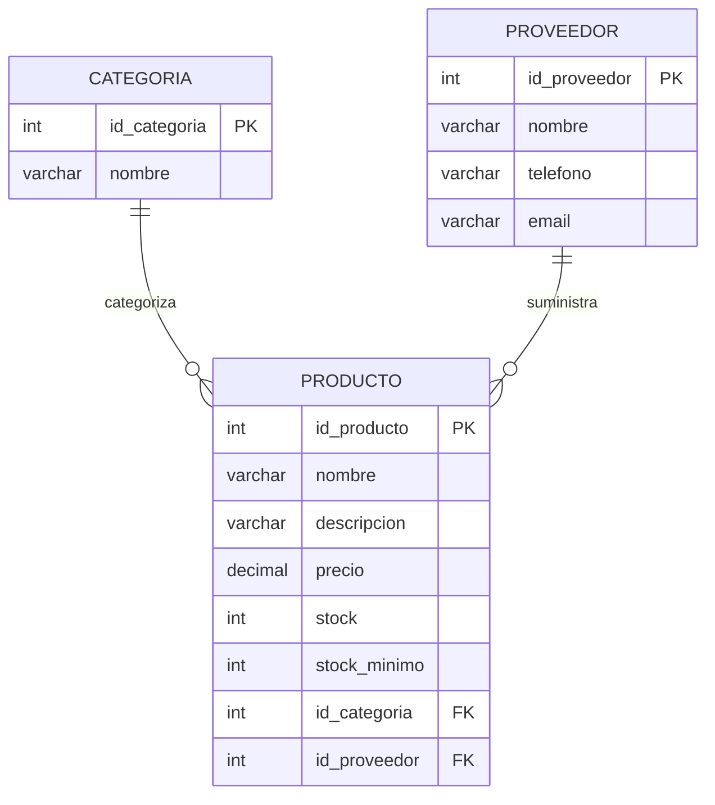

# Inventario Belleza API


API REST para la gestion de inventario de productos de belleza.
Desarrollada con Spring Boot 3, arquitectura por capas, acceso dual SQL + JPA,
documentada con Swagger UI y conectada a SQL Server.

---

## Tabla de contenido

- [Descripcion](#descripcion)
- [Tecnologias](#tecnologias)
- [Arquitectura](#arquitectura)
- [Estructura del proyecto](#estructura-del-proyecto)
- [Diagrama ER](#diagrama-er)
- [Base de datos](#base-de-datos)
- [Configuracion y perfiles](#configuracion-y-perfiles)
- [Acceso a datos](#acceso-a-datos)
- [Endpoints disponibles](#endpoints-disponibles)
- [Pruebas unitarias](#pruebas-unitarias)
- [Documentacion Swagger](#documentacion-swagger)
- [Como ejecutar](#como-ejecutar)
- [Autor](#autor)

---

## Descripcion

**Inventario Belleza** es una API REST construida con Spring Boot que permite gestionar
el inventario de productos de belleza. Implementa operaciones CRUD completas para
productos, categorias y proveedores, con un enfoque dual de acceso a datos:
SQL puro via JDBC para operaciones CRUD y JPA/Spring Data para escenarios de negocio.

---

## Tecnologias

| Tecnologia | Version | Uso |
|---|---|---|
| Java | 17 | Lenguaje principal |
| Spring Boot | 3.2.0 | Framework backend |
| Spring Web | - | Construccion de la API REST |
| Spring Data JPA | - | Acceso a datos con JPA/Hibernate |
| SQL Server | - | Base de datos relacional |
| SpringDoc OpenAPI | 2.3.0 | Documentacion Swagger UI |
| JUnit 5 + Mockito | - | Pruebas unitarias |
| Maven | - | Gestion de dependencias y build |

---

## Arquitectura

El proyecto implementa una arquitectura por capas con desacoplamiento mediante interfaces:

```
Controller → Interface Service → Service Impl → Interface DAO → DAO Impl (SQL)
                                              → JPA Repository (JPA)
```

- Los controllers acceden unicamente a interfaces de servicio (`ICategoriaService`, `IProductoService`, `IProveedorService`)
- Los services acceden al DAO para operaciones CRUD via SQL puro
- Los services acceden al Repository para escenarios de negocio via JPA
- Ningun controller accede directamente a un DAO o Repository

---

## Estructura del proyecto

```
src/
  main/
    java/com/belleza/inventario/
      config/
        SwaggerConfig.java              Configuracion de OpenAPI/Swagger
      controllers/
        CategoriaController.java        Endpoints REST de categorias
        ProductoController.java         Endpoints REST de productos
        ProveedorController.java        Endpoints REST de proveedores
      dao/
        CategoriaDAO.java               Interface DAO de categoria
        CategoriaDAOImpl.java           Implementacion SQL puro
        ProductoDAO.java                Interface DAO de producto
        ProductoDAOImpl.java            Implementacion SQL puro
        ProveedorDAO.java               Interface DAO de proveedor
        ProveedorDAOImpl.java           Implementacion SQL puro
        jpa/
          CategoriaRepository.java      Repositorio JPA de categoria
          ProductoRepository.java       Repositorio JPA de producto
          ProveedorRepository.java      Repositorio JPA de proveedor
      entities/
        Categoria.java
        Producto.java
        Proveedor.java
      services/
        ICategoriaService.java          Interface de servicio
        CategoriaService.java           Implementacion
        IProductoService.java           Interface de servicio
        ProductoService.java            Implementacion
        IProveedorService.java          Interface de servicio
        ProveedorService.java           Implementacion
      util/
        ConexionDB.java                 Utilidad de conexion JDBC
      InventarioApplication.java        Clase principal
    resources/
      application.properties            Configuracion base y perfil activo
      application-dev.properties        Configuracion de desarrollo
      application-prod.properties       Configuracion de produccion
  test/
    java/com/belleza/inventario/
      services/
        CategoriaServiceTest.java
        ProductoServiceTest.java
        ProveedorServiceTest.java
```

---

## Diagrama ER



---

## Base de datos

Ejecuta este script en SQL Server Management Studio (SSMS):

```sql
CREATE DATABASE inventario_belleza;
GO

USE inventario_belleza;
GO

CREATE TABLE categoria (
    id_categoria INT PRIMARY KEY IDENTITY(1,1),
    nombre VARCHAR(100) NOT NULL
);

CREATE TABLE proveedor (
    id_proveedor INT PRIMARY KEY IDENTITY(1,1),
    nombre VARCHAR(100) NOT NULL,
    telefono VARCHAR(20),
    email VARCHAR(100)
);

CREATE TABLE producto (
    id_producto INT PRIMARY KEY IDENTITY(1,1),
    nombre VARCHAR(100) NOT NULL,
    descripcion VARCHAR(255),
    precio DECIMAL(10,2) NOT NULL,
    stock INT NOT NULL DEFAULT 0,
    stock_minimo INT DEFAULT 5,
    id_categoria INT,
    id_proveedor INT,
    CONSTRAINT fk_producto_categoria FOREIGN KEY (id_categoria) REFERENCES categoria(id_categoria),
    CONSTRAINT fk_producto_proveedor FOREIGN KEY (id_proveedor) REFERENCES proveedor(id_proveedor)
);
```

---

## Configuracion y perfiles

El proyecto usa perfiles de Spring para separar los entornos:

### `application.properties` — configuracion base
```properties
spring.application.name=inventario
spring.profiles.active=dev
springdoc.swagger-ui.path=/swagger-ui.html
```

### `application-dev.properties` — desarrollo
```properties
server.port=8080
server.servlet.context-path=/api

spring.datasource.url=jdbc:sqlserver://localhost:1433;databaseName=inventario_belleza;encrypt=false;integratedSecurity=true;
spring.datasource.driver-class-name=com.microsoft.sqlserver.jdbc.SQLServerDriver
spring.datasource.username=
spring.datasource.password=

spring.jpa.database-platform=org.hibernate.dialect.SQLServerDialect
spring.jpa.hibernate.ddl-auto=none
spring.jpa.show-sql=true
spring.jpa.open-in-view=false

logging.level.root=INFO
logging.level.com.belleza=DEBUG
```

### `application-prod.properties` — produccion
```properties
server.port=80
server.servlet.context-path=/api

spring.datasource.url=jdbc:sqlserver://SERVIDOR-PROD:1433;databaseName=inventario_belleza;encrypt=true;integratedSecurity=false;
spring.datasource.driver-class-name=com.microsoft.sqlserver.jdbc.SQLServerDriver
spring.datasource.username=SA
spring.datasource.password=TU_PASSWORD

spring.jpa.database-platform=org.hibernate.dialect.SQLServerDialect
spring.jpa.hibernate.ddl-auto=none
spring.jpa.show-sql=false
spring.jpa.open-in-view=false

logging.level.root=ERROR
```

Para cambiar de perfil, modifica en `application.properties`:
```properties
spring.profiles.active=prod
```

---

## Acceso a datos

El proyecto implementa dos estrategias de acceso a datos en paralelo:

### SQL puro (JDBC) — operaciones CRUD

Cada entidad tiene un `DAOImpl` que usa `ConexionDB` para ejecutar SQL directamente:

| Operacion | Metodo |
|---|---|
| Listar todos | `obtenerTodos()` |
| Buscar por ID | `obtenerPorId(int id)` |
| Crear | `crear(T entidad)` |
| Actualizar | `actualizar(T entidad)` |
| Eliminar | `eliminar(int id)` |

### JPA / Spring Data — escenarios de negocio

| Entidad | Escenario | Metodo |
|---|---|---|
| Categoria | Buscar por nombre exacto | `findByNombre(String nombre)` |
| Categoria | Buscar por nombre parcial | `findByNombreContaining(String nombre)` |
| Producto | Productos bajo stock minimo | `findProductosBajoStockMinimo()` |
| Producto | Filtrar por categoria | `findByIdCategoria(int id)` |
| Producto | Filtrar por proveedor | `findByIdProveedor(int id)` |
| Producto | Precio mayor a valor | `findByPrecioGreaterThan(double precio)` |
| Proveedor | Buscar por email | `findByEmail(String email)` |
| Proveedor | Buscar por nombre parcial | `findByNombreContaining(String nombre)` |

---

## Endpoints disponibles

Base URL: `http://localhost:8080/api`

### Categorias

| Metodo | Endpoint | Descripcion | Respuesta |
|---|---|---|---|
| `GET` | `/categorias` | Listar todas las categorias | `200 OK` |
| `GET` | `/categorias/{id}` | Buscar categoria por ID | `200 OK` / `404 Not Found` |
| `POST` | `/categorias` | Crear una categoria | `201 Created` / `409 Conflict` |
| `PUT` | `/categorias/{id}` | Actualizar una categoria | `200 OK` / `404 Not Found` |
| `DELETE` | `/categorias/{id}` | Eliminar una categoria | `204 No Content` |
| `GET` | `/categorias/buscar?nombre=` | Buscar por nombre parcial (JPA) | `200 OK` |

### Productos

| Metodo | Endpoint | Descripcion | Respuesta |
|---|---|---|---|
| `GET` | `/productos` | Listar todos los productos | `200 OK` |
| `GET` | `/productos/{id}` | Buscar producto por ID | `200 OK` / `404 Not Found` |
| `POST` | `/productos` | Crear un producto | `201 Created` |
| `PUT` | `/productos/{id}` | Actualizar un producto | `200 OK` / `404 Not Found` |
| `DELETE` | `/productos/{id}` | Eliminar un producto | `204 No Content` |
| `GET` | `/productos/bajo-stock` | Productos bajo stock minimo (JPA) | `200 OK` |
| `GET` | `/productos/por-categoria/{id}` | Productos por categoria (JPA) | `200 OK` |
| `GET` | `/productos/por-proveedor/{id}` | Productos por proveedor (JPA) | `200 OK` |
| `GET` | `/productos/precio-mayor/{precio}` | Productos con precio mayor (JPA) | `200 OK` |

### Proveedores

| Metodo | Endpoint | Descripcion | Respuesta |
|---|---|---|---|
| `GET` | `/proveedores` | Listar todos los proveedores | `200 OK` |
| `GET` | `/proveedores/{id}` | Buscar proveedor por ID | `200 OK` / `404 Not Found` |
| `POST` | `/proveedores` | Crear un proveedor | `201 Created` / `409 Conflict` |
| `PUT` | `/proveedores/{id}` | Actualizar un proveedor | `200 OK` / `404 Not Found` |
| `DELETE` | `/proveedores/{id}` | Eliminar un proveedor | `204 No Content` |
| `GET` | `/proveedores/buscar?nombre=` | Buscar por nombre parcial (JPA) | `200 OK` |
| `GET` | `/proveedores/por-email?email=` | Buscar por email (JPA) | `200 OK` / `404 Not Found` |

---

## Pruebas unitarias

El proyecto incluye pruebas unitarias con JUnit 5 y Mockito para la capa de servicios.
Se prueban tanto los metodos CRUD (via mock del DAO) como los escenarios JPA (via mock del Repository).

Clases de prueba:
- `CategoriaServiceTest` — 6 pruebas
- `ProductoServiceTest` — 9 pruebas
- `ProveedorServiceTest` — 9 pruebas

Para ejecutar las pruebas:

```bash
.\mvnw test
```

---

## Documentacion Swagger

Con la aplicacion corriendo, accede en:

```
http://localhost:8080/api/swagger-ui/index.html
```

La configuracion de Swagger se encuentra en `SwaggerConfig.java` dentro del paquete `config`.

---

## Como ejecutar

**Prerrequisitos:** Java 17+, SQL Server activo con la base de datos `inventario_belleza` creada.

```bash
# Clonar el repositorio
git clone https://github.com/sebitasrios/inventario-belleza.git
cd inventario-belleza

# Ejecutar en modo desarrollo
.\mvnw spring-boot:run "-Dfile.encoding=UTF-8"
```

O desde IntelliJ: ejecuta `InventarioApplication.java` con el boton Run.

---

## Autor

**Sebastian Rios** — [github.com/sebitasrios](https://github.com/sebitasrios)

---

> Desarrollado con Spring Boot · 2026
